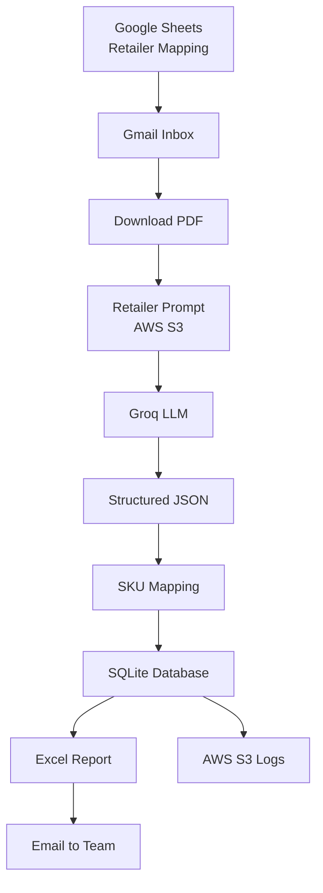

# PO Compiler

PO Compiler is an application that automates purchase order(PO) processing from email ingestion to structured data storage and report generation.

## App Interface

## Architecture

                      

   
## Overview

The app fetches PO emails using sender rules and retailer mapping (Google Sheets), downloads PDF attachments, and extracts structured data using an LLM (Groq). The data is mapped to SKUs, stored in a database, and used to generate Excel reports that are automatically shared with the team.

## Features

- Email-based PO detection using sender rules  
- LLM-based extraction from unstructured PDFs  
- SKU mapping using product master data  
- SQLite-based storage  
- Automated Excel report generation and mailing  
- Centralized logging with AWS S3 (30-day retention)  
- Easy onboarding of new retailers via mapping sheet
- Retailer-specific prompt templates stored in AWS S3, enabling prompt updates without code changes

## Workflow

1. Fetch emails based on sender rules  
2. Download PO PDFs  
3. Extract fields (PO number, items, GST, address) using LLM  
4. Map SKUs and store data in database  
5. Generate and send Excel reports  
6. Log activity to S3  

## Impact

- No code changes needed to add new retailers  
- Reduced manual effort and improved accuracy  
- Scalable for multiple vendors and formats

## Output Excel file View 

## Tech Stack

Python • Groq LLM • SQLite • AWS S3 • Google Sheets API • Pandas
